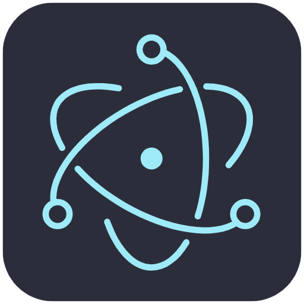
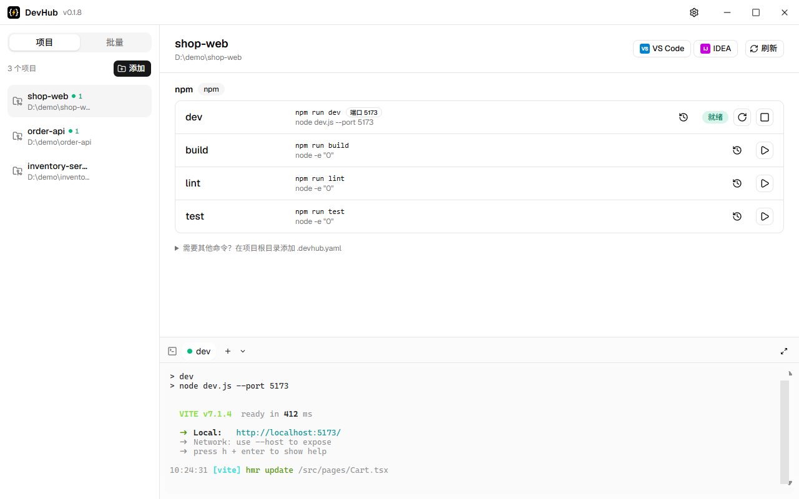
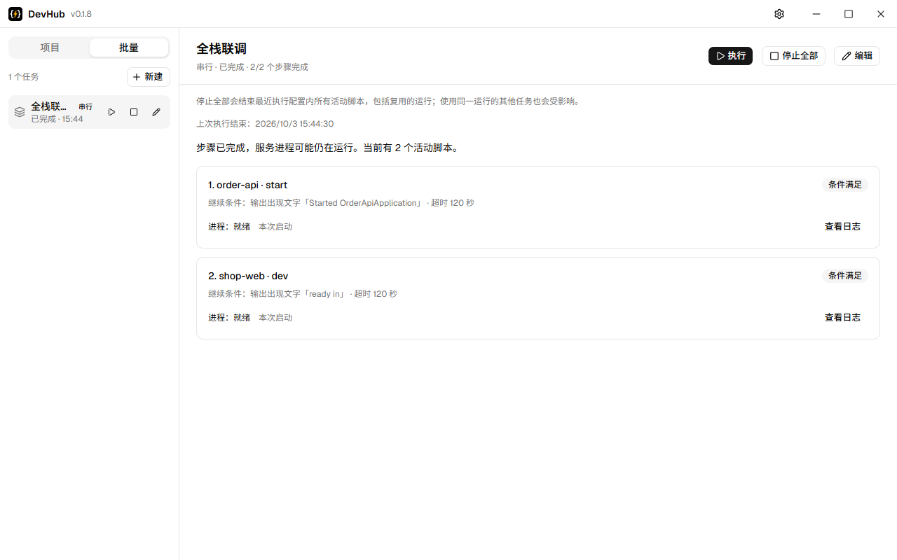

<div align="center">



# DevHub

统一管理本地多个项目的脚本：自动识别 npm / Maven / Gradle / 自定义脚本，一处批量启动、停止、看日志。

[English](README.md) · **简体中文**

[](https://github.com/Delta1035/devhub/actions/workflows/ci.yml)
[](https://github.com/Delta1035/devhub/releases/latest)
[](https://github.com/Delta1035/devhub/releases)

[](LICENSE)
[](CONTRIBUTING.md)


[官网](https://delta1035.github.io/devhub/) · [下载](https://github.com/Delta1035/devhub/releases/latest) · [功能](#功能) · [使用](#使用) · [开发](#开发) · [参与贡献](CONTRIBUTING.md)

</div>

同时开着前端、后端、mock 服务时，不用再为每个项目开一个终端窗口，也不用记各自的启动命令。

支持 Windows 与 Linux（Ubuntu / X11）。



## 功能

- **自动识别脚本**
  - npm：读取 `package.json` 的 scripts，按 `packageManager` 字段或 lockfile 选择 pnpm / yarn / npm；monorepo 子包会继承仓库根目录的包管理器
  - Maven：常用生命周期命令，Spring Boot 项目加 `spring-boot:run`；支持多模块项目，为每个应用模块生成单独的启动命令
  - Gradle：`clean` / `build` / `test`，按插件加 `bootRun` / `run`；支持多项目构建
  - 优先使用项目自带的 `mvnw` / `gradlew`
  - 识别不到的命令写进 [`.devhub.yaml`](#自定义脚本devhubyaml)
- **运行与日志**：启动 / 停止 / 重启，停止时结束整棵进程树；每个运行一个终端标签页，可交互输入，支持搜索、复制粘贴和可点击链接
- **端口与健康检查**：从命令推断端口，启动前检查端口是否被占用并指出占用进程；运行中显示启动中 / 就绪 / 无响应
- **批量任务**：跨项目组合脚本，并行或串行启动；串行步骤可以等待成功退出、输出出现指定文字、端口可连接、HTTP 返回成功或固定秒数后再继续，失败时停止后续步骤并说明原因
- **运行历史**：每个脚本保留最近 20 次运行的结果与日志，重启 DevHub 后仍可查看
- **项目内终端**：在项目目录中打开 bash / PowerShell / cmd 或自定义 shell
- **其他**：用 VS Code / IntelliJ IDEA 打开项目、托盘常驻、深浅色主题、自动更新

## 安装

从 [Releases](https://github.com/Delta1035/devhub/releases) 下载：

| 平台    | 文件                                         |
| ------- | -------------------------------------------- |
| Windows | `devhub-*-setup.exe`（安装向导，可选择目录） |
| Linux   | `.AppImage`（支持自动更新）或 `.deb`         |

安装包未签名，Windows 首次运行会出现 SmartScreen 提示，选择「更多信息 → 仍要运行」。

可以用 `SHA256SUMS.txt` 校验文件，或验证构建来源：

```bash
gh attestation verify <文件> --repo Delta1035/devhub
```

## 使用

1. 在侧栏「项目」中添加项目文件夹，右侧列出识别到的脚本。
2. 点击脚本的运行按钮，输出显示在下方终端面板；脚本行显示端口和健康状态，「历史」查看以前的运行。
3. 需要同时启动多个服务时，在侧栏「批量」中新建任务，选择各项目的脚本和启动顺序。



关闭窗口默认最小化到托盘，脚本继续运行；退出 DevHub 时停止所有运行。可在设置中改为关闭即退出。

### 自定义脚本（`.devhub.yaml`）

在项目根目录创建 `.devhub.yaml`，补充自动识别不到的命令（docker compose、带参数的启动命令、子模块等）：

```yaml
scripts:
  api:
    command: mvnw.cmd spring-boot:run -pl server # 也可以按平台写：{ windows: ..., linux: ... }
    cwd: server # 可选，相对项目目录，不能跳出项目
    description: 后端 # 可选
    port: 8081 # 可选，也可以写 ports: [8081, 8082]；省略时从命令推断
    health: /actuator/health # 可选，就绪检查改为请求该路径，期望 HTTP 2xx
```

保存后刷新或切回窗口即生效；写错时脚本列表会显示行号或字段路径。

## 开发

需要 Node.js ≥ 22、pnpm 11。

```bash
pnpm install
pnpm dev      # 启动桌面端（热更新）
pnpm check    # 格式 + lint + 类型 + 测试
pnpm e2e      # 构建并用 Playwright 驱动真实应用
```

目录结构、开发约定、提交规范和发布流程见 [参与贡献](CONTRIBUTING.md)。

## 文档

- [产品需求](docs/PRD.md)
- [架构](docs/ARCHITECTURE.md)
- [进度与已知问题](docs/PROGRESS.md)
- [架构决策记录](docs/decisions/)
- [AI 协作规则](AGENTS.md)

## Star History

[](https://star-history.com/#Delta1035/devhub&Date)

## 许可证

[MIT](LICENSE)
